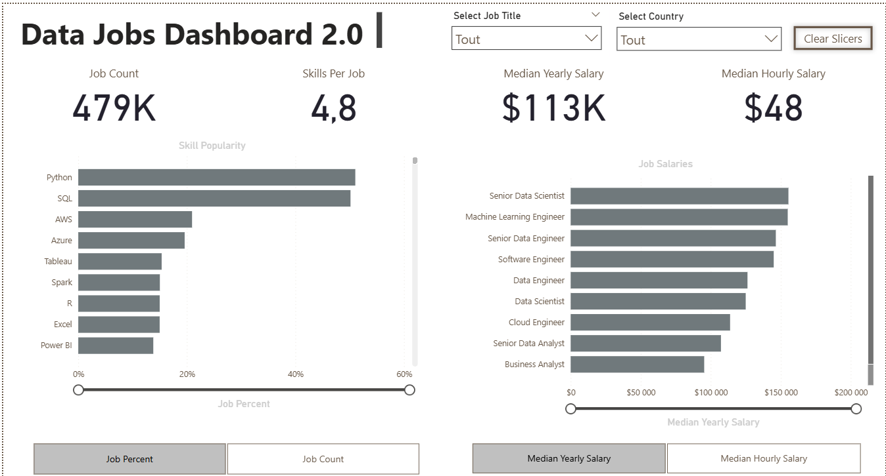
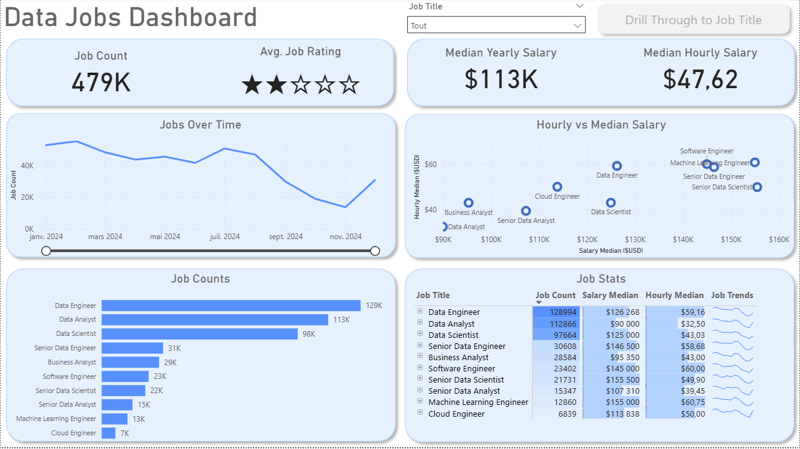

# 📊 Power BI Data Jobs Analytics & Technical Portfolio

This repository showcases a complete journey in Power BI development, featuring two versions of a **Data Job Market Analyzer** and a comprehensive breakdown of technical skills acquired (ETL, DAX, Advanced Visualization).

## 🚀 Project 1: Data Jobs Dashboard (V2.0)
**"The Streamlined Decision Tool"**

The V2.0 dashboard addresses the fragmentation of job market data. Designed specifically for **Job Seekers and Career Changers**, it consolidates complex data into a single, high-impact view.

### 🔑 Key Features
*   **Single-Page Architecture:** A consolidated view for immediate insights without navigation friction.
*   **Advanced Analytics:** Tracks Job Counts, Median Salaries ($113k avg), and Skill Popularity (Python, SQL).
*   **UX Enhancements:** Use of **Bookmarks** and **Buttons** to toggle between views and clear slicers instantly.

---

## 📈 Project 2: Data Jobs Dashboard (V1.0)
**"The Deep Dive Analysis"**

The initial version of the project, focusing on granular exploration and multi-page storytelling.

*(⚠️ Upload an image named 'dashboard_v1.png')*

### 🔑 Key Features
*   **Drill-Through Capabilities:** Users can click on a job title to access a detailed breakdown page (Remote work stats, Top platforms).
*   **Geospatial Analysis:** Interactive map showing the global distribution of opportunities.
*   **Salary Benchmarking:** Comparison of Hourly vs. Yearly pay rates using Scatter Plots.

---

## 🛠️ Technical Mastery: What's under the hood?

Beyond these dashboards, this repository represents a complete mastery of the Power BI ecosystem, from raw data to final insight.

### 1. Advanced Visualization Techniques
Implementation of a wide range of visuals to answer specific business questions:
*   **Comparison:** Bar & Column charts for categorical analysis.
*   **Trends:** Line & Area charts for time-series data.
*   **Composition:** Donut charts & Treemaps for hierarchical data.
*   **Correlation:** Scatter plots to analyze relationships (e.g., Salary vs. Rating).
*   **UX/UI:** Custom Tooltips, Slicers, and Conditional Formatting to guide the user's eye.

### 2. ETL & Data Cleaning (Power Query)
Robust data preparation pipeline to ensure accuracy:
*   **Data Profiling:** analyzing column quality and distribution.
*   **Transformation:** Handling missing values, splitting columns, and "Unpivoting" data for analysis.
*   **Modeling:** Building a **Star Schema** (Fact vs. Dimension tables) to optimize performance.

### 3. DAX Engineering (Data Analysis Expressions)
Moving beyond simple sums to create dynamic calculations:
*   **Context Mastery:** Understanding Row Context vs. Filter Context.
*   **Complex Measures:** Using `CALCULATE`, `ALL`, and `DIVIDE` for safe ratios.
*   **Parameters:** Implementation of **Field Parameters** for dynamic axis switching (e.g., changing a chart from "By Country" to "By Skill" instantly).

---

## 📂 Repository Contents
- `Data_Jobs_Dashboard_2.0.pbix` : The latest, optimized version.
- `Data_Jobs_Dashboard.pbix` : The detailed multi-page version.
- `PowerBI_Mastery_Report.pdf` : Full documentation of skills and visualization types.

---
*Developed with Power BI Desktop, utilizing Advanced DAX and Power Query.*
